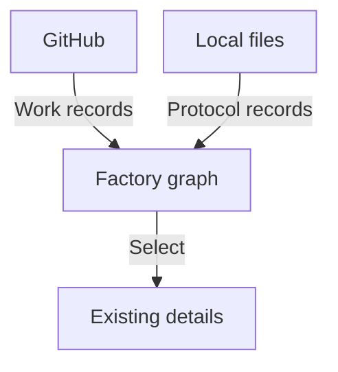

# Factory Dashboard

## Story: See the whole factory

As a factory operator, I open a connected graph and understand the work, its ownership and its recorded communication without losing the global view.

Factory Dashboard is a public project for a privately configured factory. Its first milestone reads GitHub work records and explicitly configured local communication files. The graph is the main interface; selecting a node or connection reveals existing context, attention signals and other information derivable from the approved records. The first release is read-only.



The graph combines the two sources without controlling either. Roles and the communication protocol are public. Worker implementations, credentials and installation details remain private.

## Direction and delivery

The [roadmap](docs/roadmap.md) defines the first milestone, its three epics and six tickets. It also records the longer-term destination: communicating back to resolve attention through contextual conversations, and eventually selecting teams and directing the factory from the dashboard.

Those future capabilities are not part of the first release. The [configuration contract](docs/configuration.md) makes safe source access and limited disclosure a release condition. The [ticket drafts](docs/tickets.md) define the implementation order and observable checks.

## Current state

The repository currently contains the product record and documentation tooling, not a released dashboard application. PureScript is the preferred implementation language and project default. The remaining framework/interop choices, runtime packaging and source license are still to be settled. Synthetic prototypes are exploration material rather than evidence of a live integration.

## Build and check the documentation

```sh
nix develop
just docs-speech
nix build .#docs
just docs-shell-check
```

The documentation site is published at [GitHub Pages](https://lambdasistemi.github.io/factory-dashboard/) after a change lands on `main`.

## License

No license has been selected. The repository does not currently grant reuse rights. A source license must be settled before the first product release.
