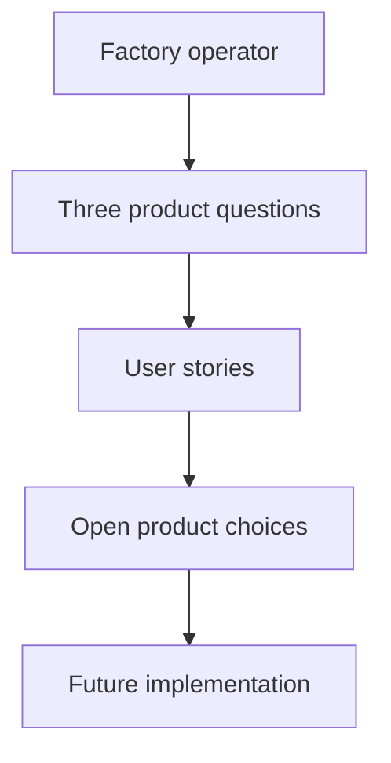

# Factory Dashboard

This repository records the product direction for an operator-facing view of factory work. The intended experience should help an operator answer three questions: where am I needed, what moved forward, and why is this happening?

## Story: Find the next useful place to look

As a factory operator, I want a clear route from the questions I have to the product stories and unresolved choices, so I can understand what this project intends before implementation begins.

The diagram shows that reading route through this repository. It does not describe a running dashboard.



## Product boundary

The proposed landing view groups decisions needing a response, items needing attention, and changes since the operator's last visit. Operators should be able to investigate an item through a work tree and detail pane. Every meaningful item must offer direct contextual communication with a worker who can answer. Prototype conversations are simulations; no live worker messaging or command backend is authorized. The application design and implementation stack remain open.

## Build and check the documentation

The repository currently contains product records and documentation tooling, not a dashboard application.

```sh
nix develop
just docs-speech
nix build .#docs
just docs-shell-check
```

The documentation site is published at [GitHub Pages](https://lambdasistemi.github.io/factory-dashboard/) after a change lands on `main`.

## License

No license has been selected. The repository does not currently grant reuse rights.
