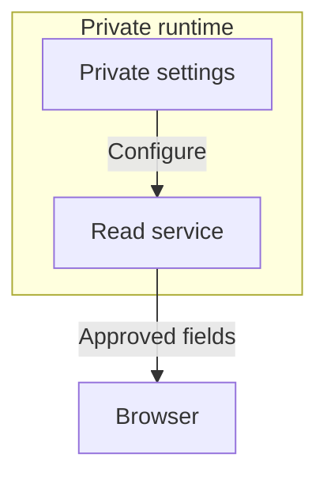

# Privacy and configuration contract

## Story: Connect an installation without publishing it

As an installation operator, I supply the locations and credentials needed to read my factory and see exactly what the dashboard can access, so I can run the public project without exposing my workers or sensitive material.

This page defines required behavior for the first milestone. The runtime and its configuration schema are not implemented yet. These requirements must become enforced checks; this document alone does not make an installation safe.

## What is public and what is private

| Category | Public project may contain | Private installation retains |
| --- | --- | --- |
| Work vocabulary | GitHub entity types and relationship meanings | Selected repositories and any non-public work records |
| Factory vocabulary | Role definitions, protocol versions, state and message semantics | Bindings from role instances to concrete workers |
| Communication | Supported file formats, reference rules, acknowledgements and examples | Real message contents and runtime journals |
| Deployment | Configuration schema and synthetic examples | Hostnames, ports, paths, users and access policy |
| Intelligence | No dependency on a particular worker implementation | Providers, model choices, prompts, launcher commands and credentials |

The graph presents roles and approved work information. It does not display provider identities, model choices, launch commands, prompt contents, secret locations or raw runtime records. Role identifiers exposed to the client must not encode those private details.

Public source code is not a public dashboard instance. A real installation requires authenticated, authorised access to its own data. The public demo is a separate, synthetic-data mode and must not inherit a real installation's credentials, files or repositories.

## Required configuration categories

The configuration ticket must define one versioned schema, a synthetic example, validation rules, and a field-by-field disclosure classification. Runtime settings are configuration rather than installation-specific constants.

| Category | Required choices | Default boundary |
| --- | --- | --- |
| Mode | Synthetic demo or real installation | Demo has no real sources or credentials. |
| GitHub | Approved API origin, repository allowlist, credential reference | No unconfigured repository reads; no mutations. |
| Local input | Explicit read roots, permitted files, supported protocol version, bounded sizes | No home-directory or machine discovery; reject path escape and symlink escape. |
| Graph projection | Approved role fields, relationships, statuses and source references | Omit raw journal text and worker internals. Unknown fields do not pass through. |
| Serving and access | Bind address, port, authenticated origin and viewer access scope | Loopback by default; wider exposure requires a complete explicit access configuration. |
| Secrets | Server-side references to externally supplied secret values | Never embed values in source, configuration examples, URLs, browser bundles or client storage. |
| Runtime storage | Dashboard-owned cache and diagnostic locations, retention | Never write to source files. Support output is redacted and excludes raw records. |

The first milestone does not need a secret manager, worker installer, remote agent, or setup wizard. A clear configuration validator and minimal operator instructions are sufficient. Credential availability is reported without printing its value or private location.

## Network and filesystem boundaries

At runtime the server's only external application traffic is read access to configured GitHub resources. It must not follow a redirect to an unapproved origin or accept an arbitrary URL from a graph item. A broad token must not make a write operation available through the dashboard.

Browser assets are served locally with the application. No analytics, remote fonts, telemetry, error-reporting service, external script CDN, automatic update check, or model-provider connection belongs in the runtime. An explicitly opened GitHub source link is operator navigation, not an automatic background fetch. Build and package acquisition are a separate, documented installation concern.

Local integration reads only explicitly configured communication inputs. The first release never writes questions, answers, acknowledgements, control files or source journals. It never launches a process described by an input file. Dashboard-owned state must be separately configured; it cannot reuse a source directory as a cache.

The diagram separates private configuration from the browser-visible projection. The two configured sources feed the read service as shown in the roadmap. The browser never receives the server's configuration object. The service must enforce the boundary before serialisation, rather than hiding sensitive fields in the UI.

## Failure behavior and release proof

Unsafe, incomplete or unsupported configuration refuses source activation and gives a redacted explanation. A source that becomes unavailable remains visibly unavailable; old data carries its last successful read time rather than appearing current. Untrusted record text is data, not an instruction, executable command, URL to fetch or HTML to render.

The release checks include deliberate negative controls: secret sentinels in denied fields, path traversal and symlink attempts, an unapproved repository or network destination, attempted GitHub mutation, malformed or oversized local records, and an installation with missing access configuration. Each must be refused or omitted at its defined boundary. Secret sentinels must be absent from browser payloads, generated assets, errors and support output. Input files are hashed before and after operation to prove read-only behavior.

A second synthetic installation uses different host settings, repository identities, directory roots and role bindings without changing application source. This demonstrates portability without publishing a real machine's details.

No project can promise perfect safety against every environment or operator decision. Release evidence must state the supported deployment, the checks performed and remaining limits. The operator reviews that evidence and configuration contract before a release proceeds.

## Decisions and limits

| Decision | Chosen approach | Alternative excluded from the first release |
| --- | --- | --- |
| Worker integration | Read configured communication files | Call providers, install workers or launch processes |
| Private values | Resolve references only on the server | Put secrets or worker bindings in browser configuration |
| Disclosure | Explicit permitted fields | Send full records and conceal them visually |
| Local authority | Read source files | Write mailbox or control messages |
| Installation help | Validate and explain required inputs | Discover or repair the operator's machine automatically |

The [roadmap](roadmap.md) carries future communication and control goals. The [ticket drafts](tickets.md) make these boundaries acceptance work rather than optional polish.
