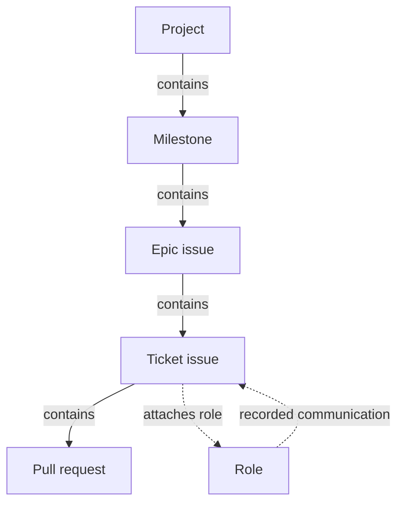

# Explore the factory graph

## Who this is for and what you can do

As a factory operator, you open one connected graph of the synthetic factory installation and explore its work structure without losing the global view: projects contain milestones, milestones contain epics and tickets, tickets contain pull requests, roles attach to the work they own, and recorded communications connect roles to the work they discussed.

You can select any record or connection to read its permitted context in the side panel, collapse a branch you are done with and expand it later, pan and zoom, fit everything back into view, and do all of it with the keyboard alone. The installation can also be explored on a narrow screen. When the record is honest about its own gaps, the graph shows that too: unknown observations, stale observations and missing references each carry their own visible label, and nothing is invented to fill a gap.

The graph below is the shape of the model the app renders. Containment is a work-membership relation; role attachment and recorded communication are their own distinct relations and never implied by proximity.

## Scenarios

The app ships four synthetic scenarios you can switch between at any time.

| Scenario | What it shows |
| --- | --- |
| Complete installation | The full synthetic factory: every kind, every relation, one unresolved external reference, and a pull-request title that contains markup-looking text rendered as plain text. |
| Empty installation | An installation with no records yet. The empty state is explicit; nothing is invented. |
| Incomplete records | An orphan milestone with no parent, an unattached role, a stale ticket and an unknown milestone — each labelled honestly. |
| Refused input | A document that breaks the input contract in several ways at once. The app refuses it visibly and lists every categorical reason without echoing any record value. |

## Keyboard and controls

- **Tab** reaches every record, missing-reference marker and connection in the graph.
- **Arrow keys** move focus along the work chain: up to the parent, down to the first child or attached role, left and right between siblings.
- **Enter** or **Space** selects the focused record or connection.
- **c** collapses or expands the focused record's branch.
- **f** fits the graph into view; **+** and **-** zoom; **0** resets the viewport; **Escape** clears the selection.
- The buttons in the graph area do the same for pointer users; dragging the graph pans it.

A collapsed branch keeps its visible handle. If the selected record ends up inside a collapsed branch, the context panel says exactly what it is behind and offers an Expand button — the selection never silently disappears.

## The input contract

The synthetic installation is a JSON document. The decoder accepts only the fields listed here; anything else is refused with a categorical reason. Refusal messages name the field and its location, never the value, so a rejected document cannot leak its contents through the refusal.

Every document starts with the schema marker `"factory-graph/1"` and two arrays, `nodes` and `edges`.

A node carries:

- `identity` — an object with a non-empty `namespace` and `key`. The pair is the record's stable identity everywhere in the app.
- `kind` — one of `project`, `milestone`, `epic-issue`, `ticket-issue`, `pull-request`, `role`.
- `title`, `summary`, `status` — approved display text.
- `sourceRef` — a source reference, or `null` when none exists. Roles must use `null`: role records carry no implementation identity, and a role that tries to carry one is refused.
- `quality` — the observation state:
  - `{ "state": "known", "provenance": …, "freshness": … }`
  - `{ "state": "unknown" }`
  - `{ "state": "stale", "provenance": …, "asOf": … }`
  - `{ "state": "missing-reference" }`

An edge carries an `identity` (non-empty `source` and `key`), a `kind`, and the two endpoint identities `from` and `to`. The three relationship kinds and their endpoint rules are:

- `contains` — work membership; the parent must sit strictly above the child in the project → milestone → epic → ticket → pull-request chain.
- `attaches-role` — from a work record to a role.
- `records-communication` — from a role to a work record.

Edge endpoints must be distinct. A reference to a well-formed identity that is not present in the document is preserved, not rejected: it appears in the graph as an explicit missing-reference marker.

## Try the app

The runnable synthetic graph is published next to this guide on the site: [open the app](../app/). Everything it loads comes from the same static instance — the page makes no requests beyond its own assets, starts no worker, and writes nothing anywhere.
