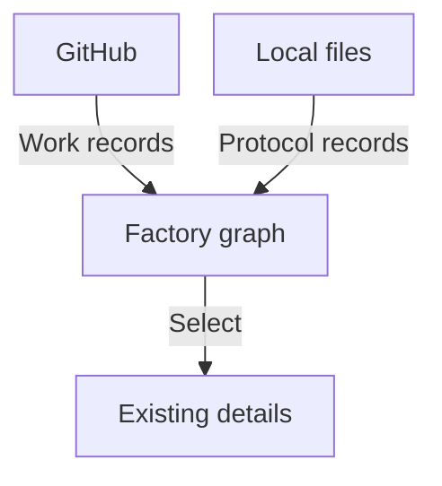

# Factory Dashboard

## Operator story

As a factory operator, I open a global graph and understand what the factory is doing, who owns each part, and which recorded communications connect the work.

The graph is the core of the product. It represents projects, milestones, epic and ticket issues, pull requests and role attachments using the actual source relationships. Selecting part of it opens existing details while the global structure remains available.

The two incoming read paths, existing-detail inspection and derived attention, status, activity and history are the first milestone. The operator notices what needs attention here and resolves it directly on the machine. The next milestone adds communicating back through local channels; the long-term goal includes operating teams from the dashboard.

## A public process, a private installation

The project publishes role definitions and the communication protocol it supports. It does not publish the intelligence behind those roles. Machine addresses, repository choices, file roots, worker bindings and credentials belong in private configuration, not application constants or browser payloads.

The first release reads GitHub and approved local files only. It makes no external model calls, writes no communication files and manages no workers. Producers are responsible for supplying the documented file protocol; suggested skills can help them do that.

## Read the product record

Start with the [milestone roadmap](roadmap.md), then the [first milestone's ticket drafts](tickets.md). The [configuration and privacy contract](configuration.md) defines what must be verified before release. [User stories](stories.md) show the present and future experience; [product decisions](open-questions.md) identify what is fixed and what remains open.

The repository currently records the intended product and its delivery plan. It does not yet provide a released application or evidence that these runtime boundaries are implemented.
