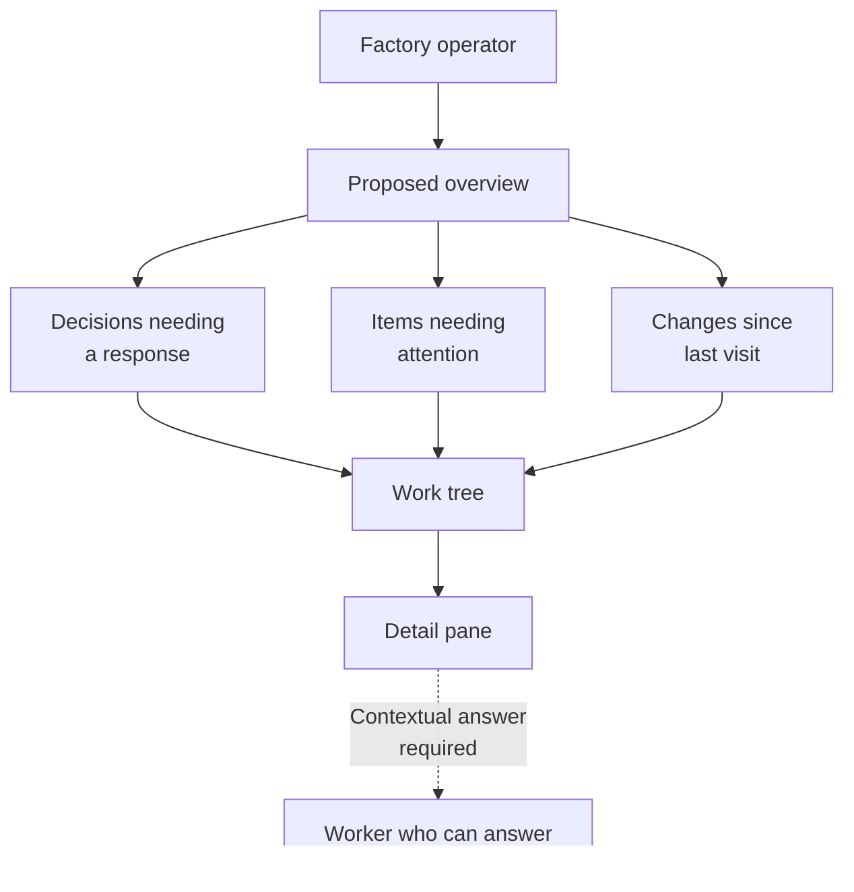

# Factory Dashboard

## Operator story

As a factory operator, I want the opening view to show where I am needed, what moved forward, and why it is happening, so I can decide where to spend my attention.

The proposed landing view brings together decisions needing a response, items needing attention, and changes since the operator's last visit. This is recorded product intent, not an implemented screen.

## Investigate an item

As an operator, I want to follow an item through a work tree into a detail pane, so I can understand its context before responding.

Every meaningful dashboard item must also offer direct contextual communication with a worker who can answer. The dashed path in the diagram marks that requirement. Its interaction and authority rules remain open, and the prototype conversations are simulations only; no live messaging or command backend is authorized.

## Read the product record

The [user stories](stories.md) state the operator needs. [Open product choices](open-questions.md) record what remains undecided, including application design, stack, and live communication authority.
