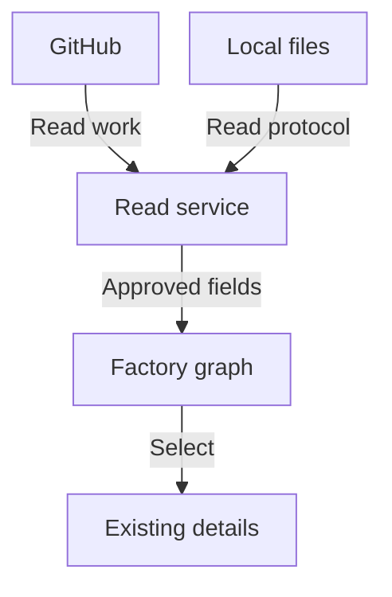

# Project roadmap

## Story: See the factory now, operate it later

As a factory operator, I open a global graph, understand the work and its ownership, and eventually use that same graph to talk to the appropriate agents and direct the factory. The first release earns that capability by making observation reliable before introducing actions.

The dashboard starts with exactly two sources: GitHub work records and explicitly configured communication files on the local system. It does not create workers or repair their setup. The public project explains the communication protocol and role vocabulary; concrete worker implementations, credentials and installation details remain private.

This is a proposed delivery plan, not a claim that these capabilities are implemented. Only the first milestone has an epic and ticket breakdown. Later milestones describe the destination and remain subject to further design.

## Milestone: Read-only factory graph

An operator runs a privately configured dashboard, sees the whole factory as a connected graph, and follows projects, milestones, epics, tickets, pull requests, roles and recorded communication without changing the factory.

GitHub supplies its existing vocabulary and relationships. The dashboard defines the additional role and communication vocabulary. Missing relationships remain visibly missing rather than being inferred into a tidy but incorrect tree. Roles are visible; provider names, models, launch commands, prompts and concrete worker identities are not part of the browser data contract.

Graph selection opens existing details, evidence and communication records. It does not send questions, write mailbox files, launch a worker or execute instructions. Read-only attention, status, activity, summaries and available history derived from approved communication and local status records belong in this release. The operator follows each finding to its graph context and supporting evidence, then goes to the machine to act. The dashboard does not resolve the finding itself.

The private service reads the two configured sources and returns an approved graph representation. Selecting part of that graph reveals the existing record. No arrow grants the browser access to a filesystem, credential, or worker launcher.

### Epic: Explore the factory through one graph

The first runnable artifact is a graph with synthetic records. This epic also delivers read-only findings and views derived from the integrated sources. Its scope covers the complete work hierarchy and role attachments, with stable selection, expansion and collapse, and contextual inspection. It establishes the browser data contract that the source tickets will consume.

Its child tickets are **Open and explore the complete factory graph** and **Derive attention and information from recorded factory state**. The graph ticket is the first implementation ticket in the project. The graph remains the application's primary screen as later tickets add real sources.

### Epic: Read the two supported sources

GitHub and configured local communication files populate that same graph. GitHub reads preserve source identities and relationships. The file reader implements a documented, versioned interpretation of roles, states, events and communication references. It reports unknown, stale, malformed and unavailable input honestly.

Its child tickets are **Read configured GitHub work into the graph** and **Read local communication records through a public protocol**. Each adds an observable source to the running dashboard, rather than delivering an isolated adapter library.

### Epic: Run privately and release with evidence

An installation supplies its own repositories, local input locations, access policy and secrets. The dashboard has no compiled-in installation identity. Its server reads only the approved inputs, emits only the approved data, and performs no outbound application communication except GitHub reads. Startup explains configuration errors without disclosing sensitive values.

Its child tickets are **Configure a private, read-only installation** and **Verify the first release's privacy and observation boundaries**. The latter verifies the integrated product and records the operator's release approval; passing a build alone does not permit release.

### Ticket order and dependencies

| Order | Ticket | Depends on | Runnable result |
| --- | --- | --- | --- |
| First | Open and explore the complete factory graph | Nothing | The graph works with synthetic data. |
| Second | Configure a private, read-only installation | The graph contract | A configured instance starts safely or explains why it refuses. |
| Third | Read configured GitHub work into the graph | Graph and configuration | The graph displays selected GitHub work. |
| Fourth | Read local communication records through a public protocol | Graph and configuration | The graph also displays recorded roles, states and communication. |
| Fifth | Derive attention and information from recorded factory state | Graph and both real sources | Attention, status, activity and available history can be inspected with evidence. |
| Sixth | Verify the first release's privacy and observation boundaries | Both real sources, derived observations and configuration | An integrated release candidate has explicit safety and outcome evidence. |

The initial execution order is serial to keep the project small. Parallel adapter work is possible only after the graph and configuration contracts are frozen and implementation ownership is agreed. This plan does not assign a team, models or execution seats.

Every epic extends the same dashboard artifact. Every implementation ticket remains unreleased until the integrated release checks pass. The first release also requires a selected source license and documented runtime support; those remain open product decisions.

### Milestone acceptance

- An operator sees attention and other useful information computable from supported communication and local status records, with a source reference, derivation rule and freshness. The operator resolves findings outside the dashboard on the machine.
- An operator opens a connected graph of configured GitHub work and recorded role activity, and inspects a node or connection without leaving the global view.
- Repository identity is part of each source reference; identical issue numbers in different repositories never collide.
- Missing, stale, unsupported and unavailable data remain distinguishable from idle, successful or completed work.
- GitHub reads and local-file reads are the only source operations. The service does not change GitHub, local communication records or workers.
- Public protocol and role documentation are sufficient for another installation to produce compatible records without learning the private worker implementation.
- Private configuration stays outside browser assets and payloads. Public examples contain synthetic values only.
- The release evidence checks data disclosure, read-only behavior, permitted network destinations, source failures and installation portability. The operator reviews that evidence before release.

## Milestone: Communicate back through the graph

After the read-only milestone is accepted and released, an operator selects an attention finding, work or a role and communicates back through configured local channels: asking a contextual question or answering a pending question so the recipient can address the issue. A reply returns to the same context and identifies the responding role without disclosing the underlying worker implementation.

The intended transport is local mailbox files consumed by an already running factory. Delivery, acknowledgement, reply correlation, unavailable recipients and retained conversations need their own design. The dashboard will not call an external AI service or choose an implementation for a role. Local write authority must be explicitly configured and tested before it is enabled.

No epics or tickets are defined for this milestone yet. It is not included in the first release.

## Milestone: Operate the factory from the dashboard

An operator selects teams and role assignments, speaks with the appropriate agents, and directs permitted work from graph context. Possible actions include assigning a team, approving a transition, or requesting a pause or resumption.

This is the long-term product goal, not current execution authority. Before it becomes an implementation plan, each action needs a clear recipient, authorisation boundary, confirmation behavior, audit record, failure handling and recovery rule. Asking a question must not silently grant permission to execute a command. Private configuration maps visible roles to actual implementations; the public product exposes the process, not the intelligence behind it.

This milestone depends on accepted observation and communication foundations. Its scope, supported operations, epics and tickets remain deliberately undefined.

## Why this sequence

| Decision | Chosen approach | Alternative deferred | Reason |
| --- | --- | --- | --- |
| Primary surface | A global connected graph | Attention-first home screen | The operator wants to see the whole factory before narrowing the view. |
| Initial capability | Read-only observation, including derived attention and history | Sending questions or controlling workers | The observational foundation must be solid and released first. |
| Integration | GitHub reads and configured local files | Provider APIs, host discovery and worker management | Keep the public product small and independent of one installation. |
| Public boundary | Roles and communication protocol | Worker implementations and real installation details | Explain how the factory coordinates while preserving private intelligence. |
| Planning detail | Tickets for the first milestone | Detailed commitments for every future feature | Keep the long-term direction visible without guessing its implementation. |

The [ticket drafts](tickets.md) define the first milestone's checks. The [privacy and configuration contract](configuration.md) records the boundaries every ticket must preserve. [Product decisions](open-questions.md) separates the fixed direction from the remaining choices.
